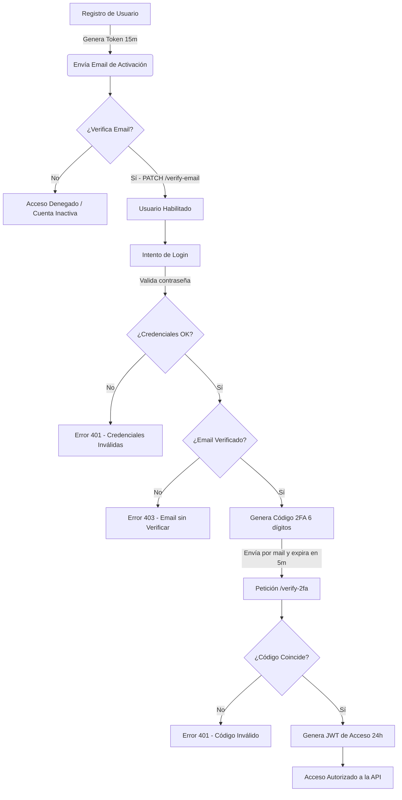

# 🚀 Slucky API (Backend) - Trabajo Integrador Final UTN

Este es el repositorio correspondiente al Backend del proyecto final **Slucky** (Slack-Clone) desarrollado para el curso Full-Stack de la Universidad Tecnológica Nacional (UTN).

---

## 🛠️ Tecnologías y Características
- **Entorno**: Node.js + Express
- **Base de Datos**: MongoDB + Mongoose (Atlas en producción)
- **Seguridad y Criptografía**:
  - Hashing de contraseñas con `bcrypt` (12 salt rounds)
  - Autenticación mediante JSON Web Tokens (JWT Bearer Token)
  - Sistema de verificación de cuenta por correo electrónico (Nodemailer + Gmail SMTP)
  - Doble factor de autenticación (2FA) por correo
- **Arquitectura**: Arquitectura robusta en capas: `Routes` ➔ `Controllers` ➔ `Services` ➔ `Repositories` ➔ `Models`.
- **Middlewares Obligatorios**:
  - `CORS` habilitado para comunicación cross-origin.
  - Validación estricta de formato y campos requeridos para Body y Query params.
  - Manejo centralizado y global de errores.

---

## 🏗️ Arquitectura de Carpetas (Layered Architecture)
```text
src/
 ├─ config/         # Configuraciones de entorno, base de datos y mailer
 ├─ controllers/    # Controladores: manejan peticiones (req) y envían respuestas (res)
 ├─ middlewares/    # Validaciones, autenticación JWT, chequeo de membresías
 ├─ models/         # Esquemas de base de datos (Mongoose)
 ├─ repositories/   # Acceso y consultas a la base de datos (Queries / ORM)
 ├─ routes/         # Definición de rutas y mapeo de endpoints
 ├─ services/       # Lógica de negocio (procesamientos complejos, envío de mails)
 ├─ utils/          # Helpers, constantes, esquemas de validación
 └─ main.js         # Punto de entrada de la aplicación Express
```

---

## 🗄️ Modelado de Base de Datos y Relaciones (Mongoose)

Para cumplir con el requerimiento de modelado de relaciones (`ref + populate`), el proyecto estructura y relaciona las siguientes entidades de MongoDB:

- **Usuario (`User`)**: Guarda los datos personales, contraseña hasheada, estado de verificación (`verification_email`) y roles globales.
- **Workspace (`Workspace`)**: Representa los espacios de trabajo. Se conecta con sus miembros a través del modelo intermedio `WorkspaceMember`.
- **Workspace Member (`WorkspaceMember`)**:
  - Relaciona un `workspace` con un `user` (usando `type: Schema.Types.ObjectId, ref: 'User'`).
  - Almacena el rol del usuario en ese espacio (`Owner`, `Admin`, `Member`).
  - Utiliza `.populate('user_id')` para resolver los datos del miembro al listarlo.
- **Workspace Channel (`WorkspaceChannel`)**:
  - Representa un canal dentro de un espacio de trabajo.
  - Guarda la referencia al workspace al que pertenece (`ref: 'Workspace'`).
- **Channel Member (`ChannelMember`)**:
  - Asocia un miembro del workspace a un canal privado/público (`ref: 'WorkspaceMember'`).
- **Channel Message (`ChannelMessage`)**:
  - Representa los mensajes enviados a los canales.
  - Se vincula con el remitente (`sender_id` con `ref: 'ChannelMember'`) y con el canal (`channel_id` con `ref: 'WorkspaceChannel'`).
  - Recupera los datos del usuario emisor mediante encadenamiento de populates: `.populate({ path: 'sender_id', populate: { path: 'user_id' } })`.
- **Verification Token (`VerificationToken`)**:
  - Almacena tokens de un solo uso de tipo JWT para flujos de verificación de email, restablecimiento de contraseñas y códigos 2FA temporales.

---

## 🔄 Flujo de Registro y Autenticación (Seguridad y 2FA)

La aplicación implementa un ciclo de vida de autenticación seguro en dos pasos (verificación de correo + doble factor 2FA):



---

## ⚙️ Requisitos y Variables de Entorno

Crea un archivo `.env` en la raíz de la carpeta `BACKEND` con las siguientes variables (puedes guiarte con este ejemplo):

```env
PORT=8080
MONGO_DB_CONNECTION_STRING=tu_string_de_conexion_mongodb_atlas
MONGO_DB_NAME=tp-final-utn
MODE=development
JWT_SECRET=clave_secreta_super_segura
URL_FRONTEND=http://localhost:5173
URL_BACKEND=http://localhost:PORT
GMAIL_USERNAME=tu_cuenta_de_gmail@gmail.com
GMAIL_PASSWORD=tu_contraseña_de_aplicacion_gmail
```

---

## ⚡ Pasos para la Instalación y Ejecución Local

1. Navegar a la carpeta del backend:
   ```bash
   cd BACKEND
   ```
2. Instalar las dependencias necesarias:
   ```bash
   npm install
   ```
3. Ejecutar la aplicación en modo desarrollo (con recarga automática):
   ```bash
   npm run dev
   ```
   *La API estará escuchando en `http://localhost:8080` (o el puerto configurado).*

---

## 📖 Documentación de Endpoints

### 🔑 Autenticación (`/api/auth`)
- **GET `/api/auth/check-email?email=...`**: Verifica si un correo electrónico ya se encuentra registrado en el sistema.
- **POST `/api/auth/register`**: Registra un nuevo usuario. Genera y envía un token de verificación por mail (expira en 15m).
- **PATCH `/api/auth/verify-email?token=...`**: Verifica el correo electrónico del usuario mediante el token recibido.
- **POST `/api/auth/login`**: Valida las credenciales. Si son válidas y el mail está verificado, genera y envía un código 2FA de 6 dígitos por email (expira en 5m).
- **POST `/api/auth/verify-2fa`**: Verifica el código 2FA provisto y devuelve el Bearer JWT definitivo de acceso (expira en 24h).
- **POST `/api/auth/forgot-password`**: Envía un enlace de recuperación de contraseña (con un token que expira en 5m).
- **POST `/api/auth/reset-password?token=...`**: Restablece la contraseña usando el token de recuperación.

### 👤 Usuarios (`/api/users`) *[Requiere JWT]*
- **GET `/api/users/me`**: Obtiene la información del perfil del usuario autenticado actual.
- **PUT `/api/users/me`**: Actualiza los datos del perfil (nombre, apellido, nombre de usuario) del usuario autenticado.

### 🏢 Workspaces (`/api/workspaces`) *[Requiere JWT]*
- **GET `/api/workspaces`**: Lista los workspaces donde el usuario es miembro.
- **POST `/api/workspaces`**: Crea un nuevo workspace (el creador se asigna como Owner).
- **GET `/api/workspaces/:workspace_id`**: Obtiene el detalle de un workspace.
- **PUT `/api/workspaces/:workspace_id`**: Modifica un workspace (solo Owner/Admin).
- **DELETE `/api/workspaces/:workspace_id`**: Elimina un workspace (solo Owner).
- **POST `/api/workspaces/:workspace_id/invitations`**: Crea y envía una invitación para unirse al workspace (solo Owner/Admin).
- **GET `/api/workspaces/:workspace_id/members`**: Lista todos los miembros del workspace (requiere ser miembro).
- **PATCH `/api/workspaces/:workspace_id/members/:member_id`**: Actualiza el rol de un miembro en el workspace (solo Owner).
- **DELETE `/api/workspaces/:workspace_id/members/:member_id`**: Elimina un miembro del workspace (solo Owner/Admin).
- **GET `/api/workspaces/:workspace_id/channels`**: Lista los canales disponibles dentro de un workspace para el usuario.
- **POST `/api/workspaces/:workspace_id/channels`**: Crea un nuevo canal en el workspace (solo Owner/Admin).
- **PUT `/api/workspaces/:workspace_id/channels/:channel_id`**: Edita la información de un canal (solo Owner/Admin).
- **DELETE `/api/workspaces/:workspace_id/channels/:channel_id`**: Elimina un canal del workspace (solo Owner/Admin).

### 📨 Invitaciones (`/api/invitations`) *[Requiere JWT]*
- **PUT `/api/invitations/:invitation_id/:decision`**: Permite aceptar (`accept`) o rechazar (`reject`) una invitación recibida para unirse a un workspace.

### 💬 Canales y Mensajes (`/api/channels`) *[Requiere JWT]*
- **GET `/api/channels/:channel_id`**: Detalle de un canal específico.
- **GET `/api/channels/:channel_id/members`**: Obtiene la lista de miembros de un canal.
- **POST `/api/channels/:channel_id/members`**: Añade a un miembro del workspace al canal (solo Owner/Admin).
- **DELETE `/api/channels/:channel_id/members/:member_id`**: Remueve a un miembro del canal (solo Owner/Admin).
- **GET `/api/channels/:channel_id/messages`**: Obtiene los mensajes del canal (con paginación).
- **POST `/api/channels/:channel_id/messages`**: Crea y envía un mensaje.
- **PUT `/api/channels/messages/:message_id`**: Edita un mensaje propio.
- **DELETE `/api/channels/messages/:message_id`**: Elimina un mensaje (propietario o moderador).

---

## 📬 Pruebas de la API (Postman Collection)

Para testear todos los flujos del backend rápidamente, se incluye una colección de Postman y sus respectivos entornos (environments) en la carpeta `postman/`:
* Colección: **[backend_slack.postman_collection.json]**
* Entorno Local: **[local.postman_environment.json]**
* Entorno de Producción: **[production.postman_environment.json]**

### Pasos para usarla:
1. Abre **Postman**.
2. Haz clic en **Import** (Importar) y arrastra tanto la colección como el entorno que desees utilizar (local o de producción).
3. Selecciona el entorno importado en la esquina superior derecha de Postman para activar la variable **`api_slack_url`** correspondiente.
4. Ejecuta las peticiones en orden: registro ➔ verificar email ➔ login ➔ verificar 2FA.
5. Al completar la verificación 2FA (`verify-2fa`), el token JWT se guardará automáticamente en la variable de colección **`auth_token`**. Las demás peticiones protegidas ya están configuradas para usar esta variable como token de autorización Bearer de forma automática.

---

## 🌐 Enlace del Despliegue Público
- **API Backend Desplegada**: `https://slucky-backend.vercel.app` 

